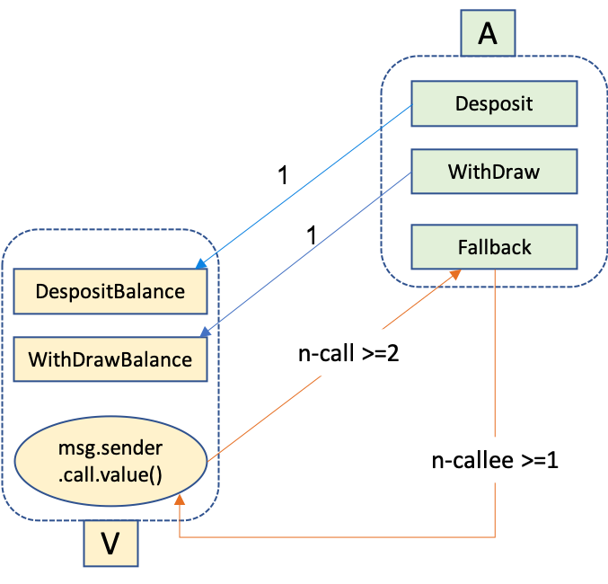
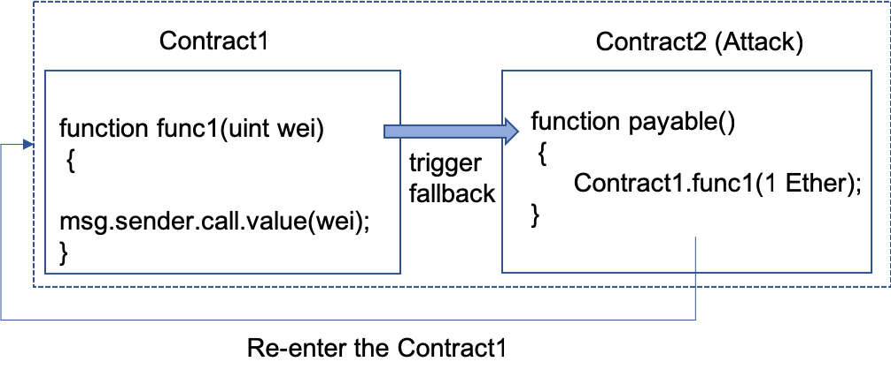
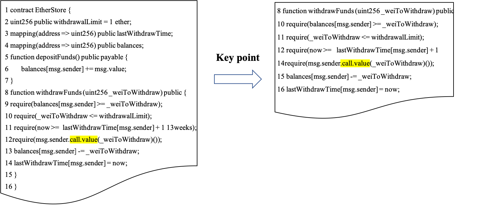

# VulDeeSmartContract   

This package is a python implementation of smart contract vulnerability detection based on deep learning. In previous studies, [VulDeePecker](https://arxiv.org/abs/1801.01681) is a design and implementation of a deep learning-based vulnerability detection system. Moreover, they present the first vulnerability dataset for deep learning approaches.  The datasets of [CWE-119](https://github.com/CGCL-codes/VulDeePecker/tree/master/CWE-119) and [CWE-399](https://github.com/CGCL-codes/VulDeePecker/tree/master/CWE-399) can be obtained [here](https://github.com/CGCL-codes/VulDeePecker). In our study, we refer to the idea of VulDeePecker to apply the deep learning to smart contract vulnerability detection. As a contribution, we offer the trainable smart contract dataset under the folder where the file name is data. It needs to be pointed out that at present we only detect the smart contract reentrancy vulnerability. 

## Requirements

#### Required Packages
* **python**3
* **TensorFlow** 1.13
* **keras** 2.2.4 with TensorFlow backend
* **pandas** for data reading and writing
* **sklearn** for model evaluation

Run the following script to install the required packages.
```shell
pip install --upgrade pip
pip install --upgrade tensorflow
pip install keras
pip install pandas
pip install scikit-learn
```

### Required Dataset
This repository contains all necessary for the smart contract dataset. For the dataset, we crawled the source code of the smart contract from the [Ethereum](https://etherscan.io/) by using the crawler tool. In addition, we have collected some data from some other websites. At the same time, we also designed and wrote some smart contract codes with reentrancy vulnerabilities. Smart contracts source code are available in `smart_contract_with_callvalue/without_callvalue`.

**Note:** crawler tool is available [here](https://github.com/Messi-Q/Crawler).

## Overview

My attempt to detect smart contract reentrancy vulnerability. We apply deep learning to the smart contract vulnerability detection.
So far, we have completed the following work:
* Uses N-grams and deep learning network to train detection model, include GRU, LSTM, BLSTM and LSTM-Attention.
* Implemented a tool to automatically construct smart contract code fragments.
  * Find the semantic-related code with the key function call.value.
  * Code gadgets are vectorized for input to neural network.
* Trained on the reentrancy vulnerability to detect exploitable code in solidity.
* Provides the trainable smart contract code fragment dataset.

### Reentrancy
**Reentrancy vulnerability** 

When an attacker initiates a transfer operation to a contract address, it will force the execution of the fallback function of the attack contract itself. The fallback function then contains the callback's own code, which causes the code to "re-enter" the contract.

**Smart contract fallback function**  
* If a contract is called, there is no match for any of the functions. Then, the default fallback function is called.
* This function is also executed when a contract receives ether (without any other data).

At present, the attacker mainly implements reentrancy through the characteristics of the Ethereum smart contract call.value function. Its characteristics include:
* When the execution fails, all the gas is consumed.
* It cannot safely prevent reentry attacks.

<div align=center></div>

Reentrancy vulnerabilities have led to the loss of millions of dollars in The DAO attacks, which eventually leads to the hard fork of Ethereum.

The following is an example of a smart contract reentrancy:

<div align=center></div>

This attack can occur when a contract sends an ether to an unknown address. An attacker can build a contract at an external address that contains malicious code in the fallback function. Therefore, when the contract sends the Ether to this address, the malicious code will be activated.

Therefore, in the current severe security contract vulnerability, an effective smart contract vulnerability detection tool is urgently needed to detect contract-related vulnerabilities. It is very necessary and useful to design and implement a smart contract security vulnerability detection device. 


### Data
Code Fragment focuses on the reentrancy vulnerabilities in smart contract(solidity programs). In total, the Code Fragment database contains 1470 code fragments, including 197 code gadgets that are vulnerable and 1273 code gadgets that are not vulnerable. Due to the limited number of smart contracts on Ethereum, we reused some smart contracts.

#### How to construct the code fragment?
* Remove all comments from the solidity source code. Remove comment tool available [here](https://github.com/Messi-Q/Automation-Tools/blob/master/delete_comment_official.py)
* Find the function where call.value is in the contract and the superior function that called the function.
* Assemble the functions found into a code fragment of a smart contract.

<div align=center></div>

All of the smart contracts dataset in these folders in the following structure respectively.
```shell
${VulDeeSmartContract}
├── data
│   ├── SmartContract.txt
│   └── SmartContractFull.txt
├── code_fragment_with_callvalue
│   └── ${file_name}.sol
├── code_fragment_without_callvalue
│   └── ${file_name}.sol
├── smart_contract_with_callvalue
│   └── ${file_name}.sol
└── smart_contract_without_callvalue
    └── ${file_name}.sol
```

* `data/SmartContract.txt`: This is the code fragment for all functions that includes `call.value`. Moreover, it is already labeled.
* `data/SmartContractFull.txt`: This is the code fragment that includes not only the `call.value` function but also key functions. Moreover, it is already labeled.
* `code_fragment_with_callvalue`: This is the code fragment after each smart contract is extracted with `call.value`.
* `code_fragment_without_callvalue`: This is the code fragment after each smart contract is extracted without `call.value`.
* `smart_contract_with_callvalue`: This is the smart contract source code with `call.value`.
* `smart_contract_without_callvalue`: This is the smart contract source code without `call.value`.

We have implemented a function that automatically extracts code fragments and presents them in this repository.

### Models

**LSTM** The baseline model is Long Short Term Memory (LSTM). Long Short Term is a special type of RNN that learns long-term dependency information. LSTM avoids long-term dependencies by deliberate design. Remember that long-term information is the default behavior of LSTM in practice, not the ability to get it at a great price. 

**GRU** Gated Recurrent Unit (GRU) is a variant of LSTM. On the one hand, GRUs have fewer parameters, so training is slightly faster or requires less data to generalize. On the other hand, if there is enough data, the powerful expressive power of LSTM may produce better results.

**BLSTM** Bidirectional LSTM consists of two LSTMs stacked one on top of the other. The output is determined by the state of the hidden layers of the two LSTMs.

<div align=center></div>

**BLSTM+Attention** The Attention mechanism is implemented by preserving the LSTM encoder's intermediate output to the input sequence, then training a model to selectively learn these inputs and correlating the output sequences with the model output.

<div align=center></div>

In our experiment, all hyperparameters are the same for the baseline LSTM, GRU, BLSTM and BLSTM+Attention, which hyperparameters from `parser.py` are used.

Implementation is very basic without much optimization, so that it is easier to debug and play around with the code.
```shell
python SmConVulDetector.py --model LSTM_Model  # to run LSTM
python SmConVulDetector.py --model GRU_Model  # to run GRU
python SmConVulDetector.py --model BLSTM  # to run BLSTM
python SmConVulDetector.py --model BLSTM_Attention # to run BLSTM with Attention
```

### Code Files

1. `SmConVulDetector.py`
* Interface to project, uses functionality from other code files.
* Fetches each gadget, cleans, buffers, trains Word2Vec model, vectorizes, passes to neural net.
2. `clean_fragment.py`
* For each gadget, replaces all user variables with "VAR#" and user functions with "FUN#".
* Removes content from string and character literals.
3. `vectorize_fragment.py`
* Converts gadgets into vectors.
* Tokenizes gadget (converts to symbols, operators, keywords).
* Uses Word2Vec to convert tokens to embeddings.
* Combines token embeddings in a gadget to create 2D gadget vector.
4. `automatic_generate_code_fragment.py`
* All functions in the smart contract code are automatically split and stored.
* Find the function where call.value is located and the superior function that called the function.
* Assemble the functions found into a code fragment of a smart contract.

**Note:** If you use the automation tool for generating code fragment, you need to normalize your smart contract code. Such as:
1. The function name, parameters, and return value are on one line.
```shell
 function div(uint256 _a, uint256 _b) internal pure returns (uint256) {
```
2. Remove irrelevant information from the contract, such as comments.
3. There are as few empty lines as possible between statements, and it is best to stick them between statements.
bad example:
```
function transfer(address _to, uint _value, 
         bytes _data, string _custom_fallback) 
         public returns (bool success) {
         
        require(_value > 0 && frozenAccount[msg.sender] == false 
        && frozenAccount[_to] == false 
        && now > unlockUnixTime[msg.sender] 
        && now > unlockUnixTime[_to]);

        if (isContract(_to)) {
        
            require(balanceOf[msg.sender] >= _value);
            balanceOf[msg.sender] = balanceOf[msg.sender].sub(_value);
            
            
            
            balanceOf[_to] = balanceOf[_to].add(_value);
            assert(_to.call.value(0)(bytes4(keccak256(_custom_fallback)), msg.sender, _value, _data));
            Transfer(msg.sender, _to, _value, _data);
            
            
            
            Transfer(msg.sender, _to, _value);
            return true;
            
        } else {
        
            return transferToAddress(_to, _value, _data);
        }
    }
```

good example:
```
function transfer(address _to, uint _value, bytes _data, string _custom_fallback) public returns (bool success) {
        require(_value > 0 && frozenAccount[msg.sender] == false && frozenAccount[_to] == false && now > unlockUnixTime[msg.sender] && now > unlockUnixTime[_to]);

        if (isContract(_to)) {
            require(balanceOf[msg.sender] >= _value);
            balanceOf[msg.sender] = balanceOf[msg.sender].sub(_value);
            balanceOf[_to] = balanceOf[_to].add(_value);
            assert(_to.call.value(0)(bytes4(keccak256(_custom_fallback)), msg.sender, _value, _data));
            Transfer(msg.sender, _to, _value, _data);
            Transfer(msg.sender, _to, _value);
            return true;
        } else {
            return transferToAddress(_to, _value, _data);
        }
    }
```

### Running project
* To run program, use this command: python SmConVulDetector.py --dataset [code_fragment_file], where code_fragment_file is one of the text files containing a fragment set.
* In addition, you can use specific hyperparameters to train the model. All the hyperparameters can be found in `parser.py`.

Examples:
```shell
python SmConVulDetector.py --dataset data/SmartContract.txt
python SmConVulDetector.py --dataset data/SmartContract.txt --model BLSTM --lr 0.002 --dropout 0.5 --vector_dim 100 --epochs 10 --batch_size 32
```

Using script：
Repeating 10 times with `train.sh`.
```shell
for i in $(seq 1 10); do python SmConVulDetector.py --model BLSTM | tee logs/smartcheck_"$i".log; done
./train.sh
```
Then, you can find the training results in the `logs`.

## Results
The performance evaluation of the model is shown in the following table. We also repeat experiments 10 times to calculate the average. The performance evaluation results on the `SmartContract.txt` dataset are given below. 

| Model | Accuracy(%) | False positive rate(FP)(%) | False negative rate(FN)(%) | Recall(%) | Precision(%) | F1 score(%) |
| ------------- | ------------- | ------------- | ------------- |  ------------- |  ------------- |  ------------- |
| GRU | 82.33 | 25.17 | 10.23 | **89.77** | 78.28 | 83.49 |
| LSTM | 81.86 | **25.81** | 10.47 | 89.53 | 77.80 | 83.06 |
| BLSTM | 85.00 | 19.07 | 10.93 | 89.07 | 83.24 | 85.57 |
| BLSTM+Attention | **85.69** | 17.21 | **11.40** | 88.60 | **84.82** | **86.26** |

These results were obtained by running:

`python SmConVulDetector.py -D data/SmartContract.txt --lr 0.002 --dropout 0.5 --vector_dim 100 --epochs 10
`

## Other(basic)

For this, we try to use the word segmentation method to train smart contract dataset. In addition, we used the library of `torchtext` to experiment. The specific experimental process is referenced [here](https://github.com/keitakurita/practical-torchtext). We experimented with our own dataset(smart contract code fragment).

You can install torchtext by:
```shell
pip install torchtext
```

## References
1. Zhen Li, Deqing Zou, Shouhuai Xu, Xinyu Ou, Hai Jin, Sujuan Wang, Zhijun Deng and Yuyi Zhong. [VulDeePecker: A Deep Learning-Based System for Vulnerability Detection](https://arxiv.org/abs/1801.01681).
2. VulDeePecker algorithm implemented in Python. [VDPython](https://github.com/johnb110/VDPython).
3. A set of tutorials for torchtext. [practical-torchtext](https://github.com/keitakurita/practical-torchtext).
